

ALU UVM Omar Magdy

![ref1] ALU UVM

The verification environment is compiled and run using **VCS**.

Run make to compile and run the test bench and generate the coverage reports.

![ref1] AGENDA

ALU Design

Environment Architecture

­Sequence Item ­Sequence ­Sequencer ­Driver

­Monitor

­Agent ­Scoreboard ­Coverage Collector ­Environment

­Test

­Top

Assertions Simulation Results Coverage Closure

![ref1] ALU 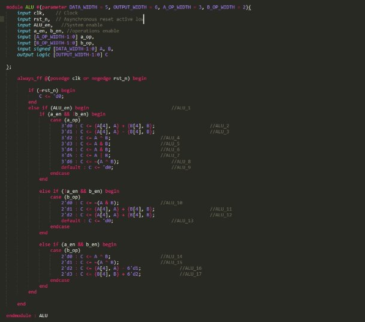

The verification environment is designed  to fully verify ALU. 

It has 10 ports, 9 input ports and 1  output port. 

There are three operation sets, each of  them are used depending on the  different combinations of “a\_en” and  “b\_en”. 

![ref1] PACKAGE

Package file is created to group common parameters that are used in multiple classes like input bit width, maximum positive, and negative values.

Also, it contains defined enums to facilitate dealing with the operations.

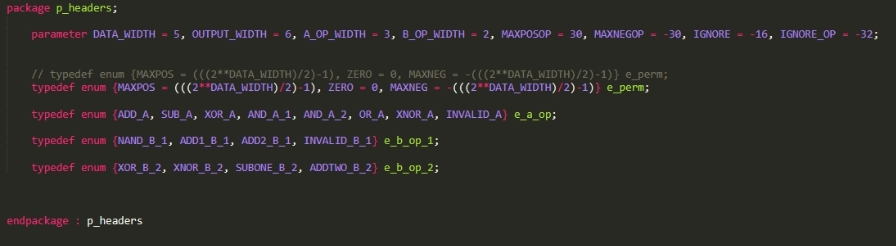

![ref1] ENVIRONMENT ARCHITECTURE

The UVM environment consists of:

­Sequence item: required to have the data to be randomized.

­Sequence: responsible for defining the scenario in which the sequence item randomization depends on. ­Sequencer: used to drive sequence item from sequence to driver.

­Driver: receives data from sequencer and drives the interface signals.

­Monitor: samples the DUT signals and convert them to transaction level.

­Agent: encapsulates driver, monitor, and sequencer.

­Scoreboard: checks the transaction coming from monitor.

­Coverage Collector: samples the incoming transaction to calculate functional coverage.

­Environment: encapsulates scoreboard, coverage collector.

­Test: it determine which sequence will be run.

­Top: it connects the DUT to the testbench.

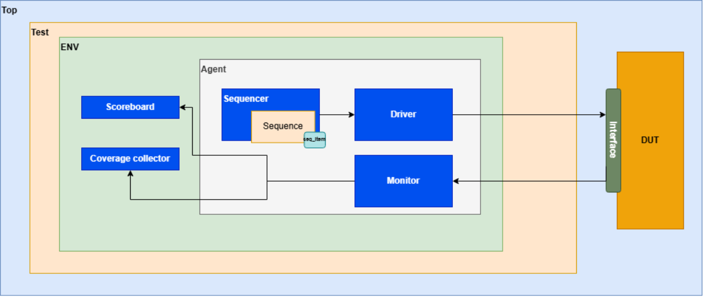

![ref1] SEQUENCE ITEM

Sequence item contains the data that is  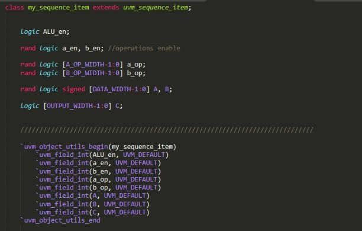going to be randomized. 

Also, it has the constraints in which the  randomization will use to achieve the  highest functional coverage. 

Field macro is used to determine which  data is going to be printed. 

![ref1] SEQUENCE

The sequence determine the scenario for testing. The sequence class has 4 scenarios:

­One for a\_op set.

­One for the first b\_op set.

­One for the second b\_op set. ­One is a randomization sequence.

Final sequence is used to wrap and all sequences using uvm\_do macro.

![ref1] SEQUENCE

Sequence a\_op 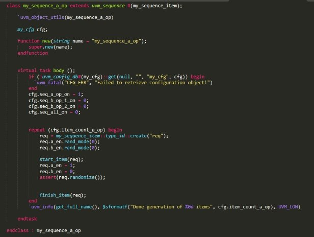

­The sequence turn off randomization for a\_en 

and b\_en and sets them to 1 and 0 respectively  to enable the a\_op set. 

­It get the item count from configuration object  

set in the test. 

![ref1] SEQUENCE 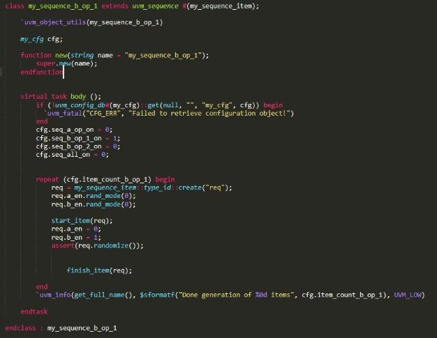

Sequence b\_op 

­The sequence turn off randomization for a\_en 

and b\_en and sets them to 0 and 1 respectively  to enable the b\_op set. 

­It get the item count from configuration object  

set in the test. 

![ref1] SEQUENCE 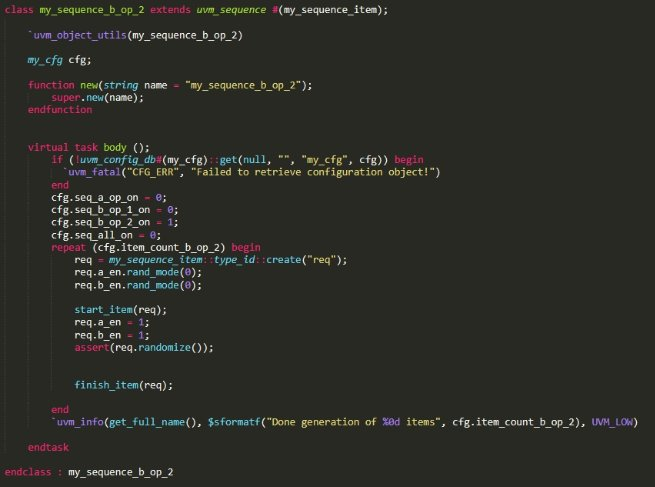

Sequence b\_op 

­The sequence turn off randomization for a\_en 

and b\_en and sets them to 1 and 1 respectively  to enable the b\_op set. 

­It get the item count from configuration object  

set in the test. 

![ref1] DRIVER 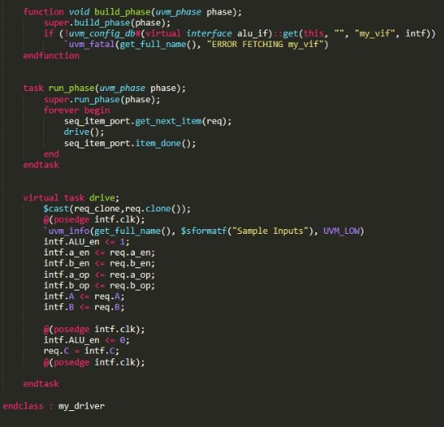

The driver transforms from transaction  level to pin level. 

![ref1] MONITOR 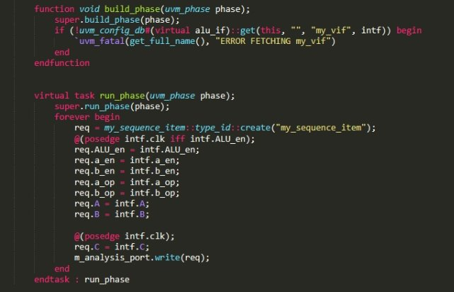

The Monitor is responsible for sampling  interface values and assigning them to  sequence item which will be sent to  Scoreboard and Coverage collector  classes. 

![ref1] AGENT

It encapsulates driver, monitor, and  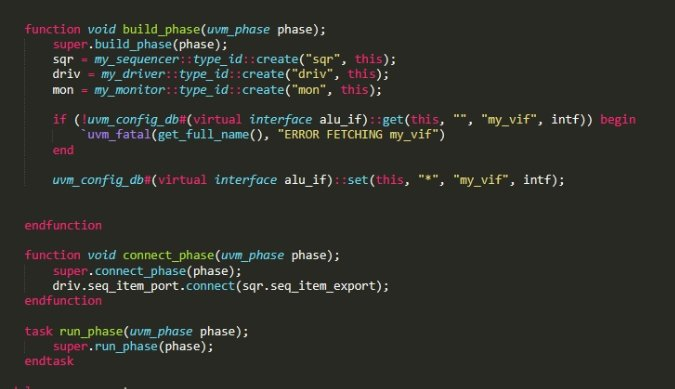sequencer. 

![ref1] SCOREBOARD

Scoreboard receives the transactions from Monitor class.

It samples transaction values to evaluate the expected output and check the actual output value sampled from the same transaction.

 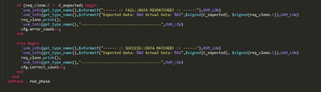 The scoreboard increments the number  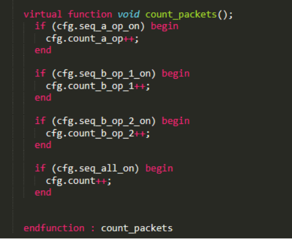of incoming packets from each sequence  to verify all packets are received by the  scoreboard. 

![ref1] COVERAGE COLLECTOR

The class is responsible for grouping the  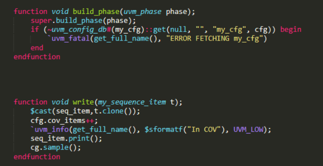cover points and cross coverage for the  transaction values. 

This ensures ALU functionality is fully  checked. 

The cover group is sampled when  collector class receives the transaction. 

Illegal bins are defined for the  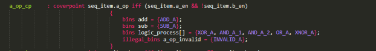prohibited operations in set A and set  B1.

Furthermore, illegal bins are defined for  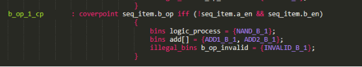“-32” for “C” and “-16” for both “A”  and “B”. 

Ignore bins are defined for “-31,31” as they can not be achieved given the  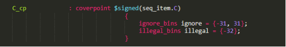range of the inputs [-15, 15]. 

![ref1] ENVIRONMENT

Environment class encapsulates Agent,  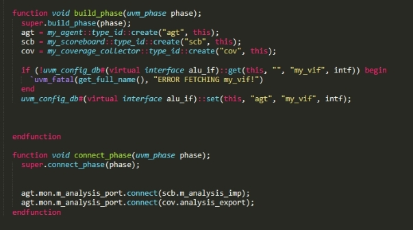Scoreboard, and Coverage Collector  classes. 

![ref1] TEST

Test program creates the Environment  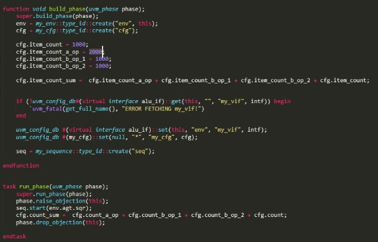class and starts the intended sequence. 

The number of packets in each sequence  are determined in build phase. 

Phase ready to end function is used to ensure the test does not end before all packets are processed.

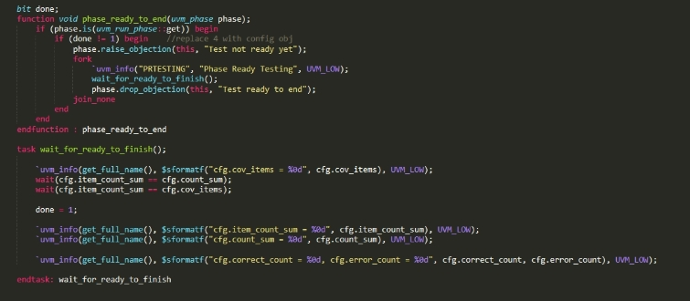

![ref1] TOP 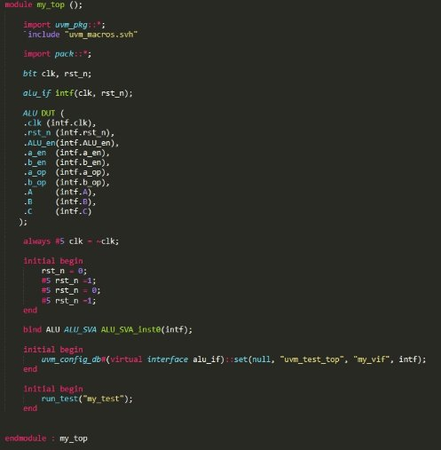

Top module initiates DUT, Test, and  interface. 

System clock is generated and passed to  the interface as an input. 

Bind is used to initiate ALU\_SVA module  in ALU module. 

![ref1] ASSERTIONS

Assertions module is created to group  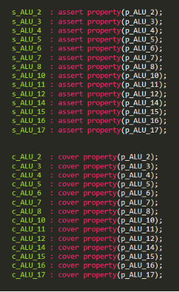multiple properties of the design to fully  ensure the properties of the design are  covered. 

![ref1] SIMULATION RESULTS

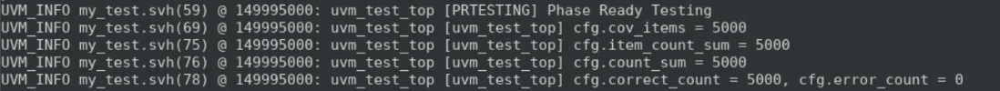

![ref1] ASSERTIONS AND COVERAGE CLOSURE

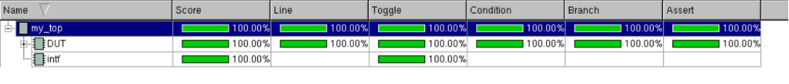

[ref1]: Aspose.Words.e44ee407-5e1a-4583-98a7-7a3745329b24.003.png
